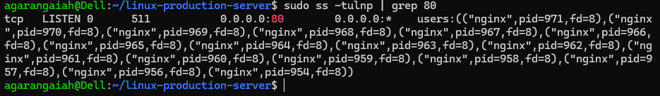

## Project Screenshots

### Website Running on Localhost

### Nginx Configuration Test

### Port 80 Listening

### UFW Firewall Status

<<<<<<< HEAD
# Linux Production Web Server Project

## Overview
This project simulates a real production Linux web server environment.

## What I Implemented
- Created custom users (adminuser, webuser)
- Managed permissions and ownership
- Installed and configured Nginx
- Hosted static website
- Understood reverse proxy concept
- Managed services without systemd (WSL environment)

## Technologies Used
- Ubuntu
- Nginx
- Linux File Permissions
- User Management
- WSL

## Folder Structure
- nginx-config/
- website/

## Key Learning
This project helped me understand real server administration and production deployment concepts.
=======
# linux-production-webserver
Simulated real-world production Linux server environment with user management, permission control, and Nginx deployment.
>>>>>>> 5f163a958d76cb199ea7cb9101a905b18f2c98db
